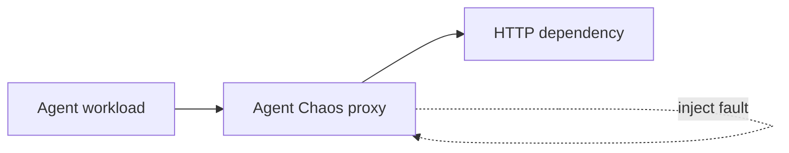

# Agent Chaos

**Chaos engineering for autonomous AI agents.**

AI agents increasingly depend on unreliable model APIs, tools, databases, and HTTP services.
Agent Chaos intentionally disrupts those dependencies so developers can measure whether an
agent-like workload tolerates a fault, retries successfully, or fails.

Agent Chaos v0.1 is an early open-source vertical slice. It is framework-independent and does
not require an OpenAI or Anthropic API key.



## Install

The published Python distribution is named `agent-chaos-runner`; the product and installed
command remain Agent Chaos and `agentchaos`.

```bash
uv tool install agent-chaos-runner
agentchaos --version
```

Agent Chaos supports Python 3.12+ on macOS and Linux.

## Quick start

Clone the repository to run the deterministic local demo without API keys:

```bash
git clone https://github.com/Coroz2/agent-chaos.git
cd agent-chaos
uv sync --extra dev --locked
uv run agentchaos run examples/scenarios/api_503_recovery.yaml
```

The scenario starts its deterministic fake dependency automatically. A successful run ends with
`RECOVERED` and writes its artifacts under `.agentchaos/runs/<run-id>/`.

Other examples:

```bash
uv run agentchaos run examples/scenarios/no_fault.yaml
uv run agentchaos run examples/scenarios/api_latency_recovery.yaml
uv run agentchaos run examples/scenarios/api_503_failure.yaml
```

The final command deliberately exits with status 1 because recovery is not observed.

## Scenario

```yaml
schema_version: 1
name: api-503-recovery

dependency:
  type: http
  base_url: http://127.0.0.1:19103
  start:
    command: [python, fake_api.py, --port, "19103"]
    cwd: ..
    readiness:
      path: /health

workload:
  name: demo-agent
  command: [python, demo_agent.py]
  cwd: ..
  proxy_url_env: CUSTOMER_API_URL

fault:
  type: http_error
  target:
    method: GET
    path: /customer/*
  trigger:
    occurrence: 2
  status_code: 503

success:
  exit_code: 0
```

The optional managed dependency is intended for local tests. Omit `dependency.start` when the
upstream already exists. Agent Chaos always exposes the generated proxy URL as
`AGENTCHAOS_PROXY_URL`; `proxy_url_env` maps it into the variable an existing workload expects.

## Results

- `PASSED`: a baseline succeeds, or the workload tolerates injected latency without failure.
- `RECOVERED`: a faulted operation fails, a matching retry succeeds, and the workload succeeds.
- `FAILED`: execution fails, the fault never fires, or no successful recovery is observed.

Successful and recovered experiments exit 0. Experiment failures exit 1, invalid scenarios exit
2, setup failures exit 3, and interruptions exit 130.

Every valid run contains:

```text
.agentchaos/runs/<run-id>/
├── scenario.yaml
├── events.jsonl
├── stdout.log
├── stderr.log
├── dependency.stdout.log
├── dependency.stderr.log
└── report.json
```

`events.jsonl` is a versioned, sequence-ordered event stream. `report.json` provides stable result
and reason codes plus workload, fault, recovery, timing, and artifact details.

## Commands

```bash
uv run agentchaos --help
uv run agentchaos --version
uv run agentchaos version
uv run agentchaos validate examples/scenarios/api_503_recovery.yaml
uv run agentchaos run examples/scenarios/api_503_recovery.yaml
```

Use `--output-dir PATH` to place run directories somewhere other than `.agentchaos/runs`.

## Documentation

- [Project vision](docs/PROJECT-VISION.md): stable mission, principles, capability map, and
  boundaries.
- [Documentation index](docs/README.md): authority map for specifications, release guidance, and
  archived planning.
- [v0.1 specification](docs/specs/v0.1.md): complete contract for the released v0.1 behavior.

## Development

```bash
uv sync --extra dev
uv run pytest
uv run ruff check .
uv run ruff format --check .
uv run mypy
```

See [CONTRIBUTING.md](CONTRIBUTING.md) for the branch, pull request, verification, and release
workflow.

## Limitations

v0.1 supports one HTTP dependency and zero or one fault on macOS and Linux. It is a reverse proxy,
not transparent network interception: the workload must accept the proxy base URL through its
configuration. Request bodies and responses are buffered up to 10 MiB. Streaming, SSE,
WebSockets, CONNECT tunneling, TLS interception, multiple faults, probabilistic triggers, and
model-specific grading are not implemented.

Retry classification uses a deterministic fingerprint of method, path, hashed query, and body.
It is useful black-box evidence, not proof of the workload's internal intent.

## Roadmap

The next logical steps are richer HTTP failures such as 429s and connection resets, richer trigger
policies and multi-fault campaigns, then another dependency adapter such as MCP. These are broad,
nonbinding directions; detailed release scope begins only in an approved version specification.

Licensed under Apache-2.0.
